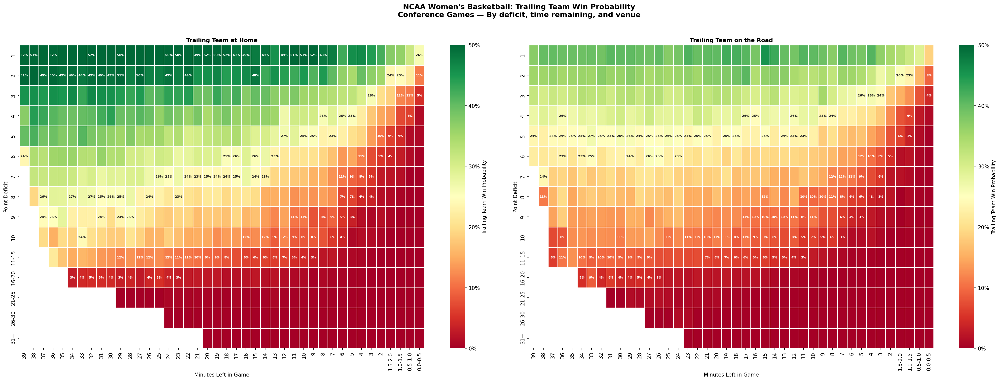
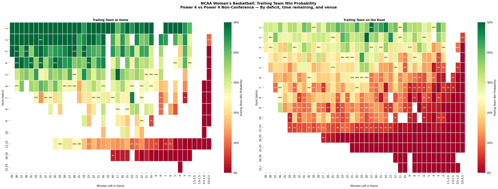

# How Often Do Division I Women's Basketball Teams Come Back?

If a team is down 10 points at halftime, should you change the channel? What about 20 points with five minutes left? This project puts numbers on those questions using play-by-play data from more than 40,000 NCAA Division I women's basketball games across 25 seasons (2001–02 through 2024–25).

For every scoring play where one team was trailing, we recorded the deficit, the time remaining, and whether the trailing team was at home or on the road. Then we grouped those situations into buckets and calculated how often the trailing team came back to win. The result is a probability table covering every realistic combination of deficit, clock, and venue.

## The patterns

The heatmaps below show the full picture — one for home teams trailing, one for road teams. Time remaining runs left to right, deficits top to bottom, and color runs from green (good chances) through yellow to red (nearly impossible).

### Small deficits are surprisingly stable

A home team down by 1 point wins about 52% of the time — making it the only deficit where the trailing team is actually the favorite. That rate barely changes whether there are 30 minutes left or 5 minutes left, and only starts dropping inside the final two minutes. Road teams trailing by 1 win about 37% of the time, lower but still remarkably steady through most of the game.

### Five points is the threshold where time starts mattering

Down 5 at home with most of the game remaining, a team wins about 31% of the time. With 2 minutes left, that drops to single digits. For road teams trailing by 5, the numbers are lower across the board — about 20% early, falling faster.

### Double-digit deficits are steep

Down 10 early in the game, the win rate is around 12% for home teams and 7% for road teams. By the second half, it's under 5% either way. Beyond 15 points, even with most of the game left, the numbers are in the low single digits.

The win probability curves show these dynamics more directly, with solid lines for home teams and dashed lines for road teams:

## Home court advantage

The gap between home and away is consistent and substantial:

| Deficit | Home trailing | Away trailing | Gap |
|---------|:---:|:---:|:---:|
| 1 pt | 52.3% | 37.0% | +15.3 |
| 5 pts | 30.9% | 20.1% | +10.7 |
| 10 pts | 12.2% | 7.2% | +5.0 |
| 11–15 pts | 7.3% | 3.9% | +3.5 |
| 16–20 pts | 1.8% | 0.8% | +1.0 |

The advantage narrows at larger deficits — there's simply less variance to exploit when you're down 20 — but it never disappears entirely.

## Conference games: tighter, harder to come back

Conference games account for about 14,000 of the 40,000 games in the dataset. Because conference opponents are more evenly matched and more familiar with each other, you might expect comebacks to be more common. The opposite is true — comeback rates in conference play are slightly lower across the board.

A home team trailing by 1 in a conference game wins 50.2% of the time, compared to 52.3% overall. Down 5, the gap is about a percentage point. Down 10, conference games show an 11.0% comeback rate versus 12.2% overall. The differences are small but consistent, suggesting that scouting and familiarity make it harder — not easier — to erase a deficit against a conference opponent.

Ohio State's 18-point comeback against Penn State in 2018–19, with 7 minutes remaining, stands as the most improbable conference comeback in the dataset. Oklahoma erased a 21-point deficit against Kansas State in 2009–10. Purdue overcame 16 points against Michigan in 2017–18.

## Power 4 non-conference: home court advantage amplified

When Power 4 teams (ACC, Big 12, Big Ten, SEC) play each other outside of conference — tournaments, early-season matchups, neutral-site events — the patterns shift. With 822 games in this subset, the samples are smaller, but the trends are clear.

Home teams trailing by 1 win 54.8% of the time, higher than the D-I average. The overall home comeback rate of 29.6% also exceeds the 27.6% baseline. Meanwhile, road teams in these matchups come back just 14.7% of the time, below the 15.6% D-I average. The combination suggests that when elite programs host each other in non-conference play, home court advantage is especially pronounced.

The most improbable Power 4 non-conference comeback: Oklahoma overcame an 11-point road deficit against Illinois with just 4.1 minutes remaining in 2014–15. Alabama erased 17 points against Oklahoma State in 2020–21 with most of the game still to play. Duke dug out of a 16-point hole against Ohio State in 2023–24.

## The most improbable comebacks

With a venue-aware probability table, we can trace every game's win probability and find the moments where the trailing team's chances hit rock bottom.

The most improbable D-I comeback in the dataset: Miami (OH) over Oakland in 2023–24, overcoming a 6-point deficit with just 0.4 minutes remaining — a situation where the probability table shows essentially 0% of trailing teams winning. UNLV's 21-point road comeback against Portland State in 2017–18, with 5.5 minutes left, ranks second. North Alabama erased a 10-point away deficit against Jacksonville with 1.3 minutes on the clock in 2018–19.

What makes these comebacks improbable isn't always the raw deficit — it's the combination of deficit, time, and venue. A 6-point deficit sounds manageable, but with 24 seconds left it's nearly impossible. A 21-point deficit is enormous, but with 5 minutes left on the road it's even worse than it sounds.

## What it doesn't tell you

This table doesn't know about foul trouble, injuries, pace of play, or which players are on the floor. It knows three things: the deficit, the clock, and whether the trailing team is at home. It covers regulation only — four quarters, 40 minutes. Overtime is excluded because its time structure is different.

These are real limitations. But with 40,000 D-I games in the sample, the table provides a solid baseline for what typically happens — and the home/away split adds a dimension that meaningfully changes the picture for close games.

## How to use the data

The probability tables are available as CSV files:

- `data/comeback_probs.csv` — all D-I games
- `data/comeback_probs_conference.csv` — conference games only
- `data/comeback_probs_power4_nonconf.csv` — Power 4 vs. Power 4 non-conference

Each row has a deficit bucket, a time bucket, a venue (home or away), the number of games observed, the trailing team's win percentage, and Wilson 95% confidence interval bounds. Cells with fewer than 30 games are flagged as low-confidence.

You could use these to add win probability to a live game tracker, evaluate how improbable a particular comeback was, or compare comeback dynamics across different competitive contexts.
