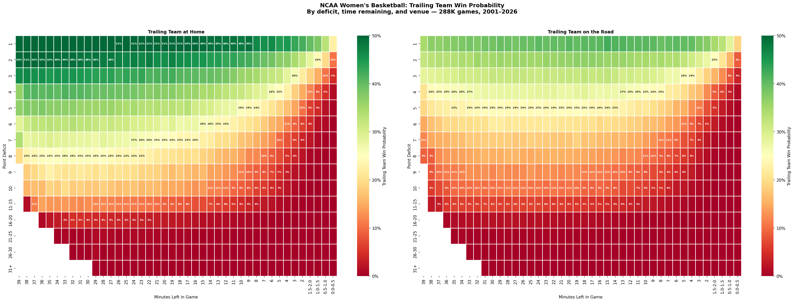
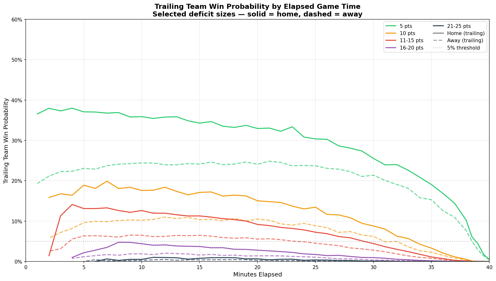
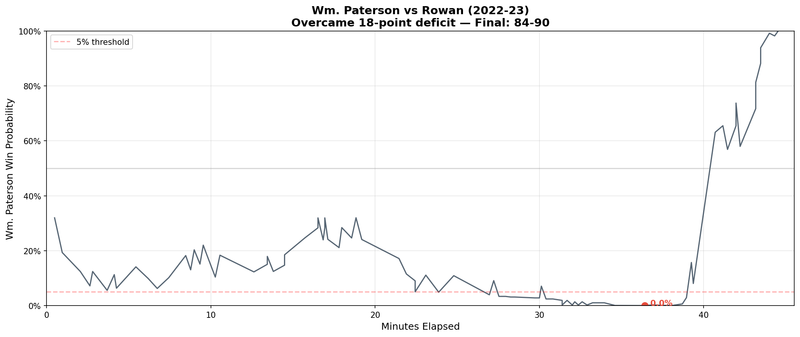

# How Often Do Women's Basketball Teams Come Back?

If a team is down 10 points at halftime, should you change the channel? What about 20 points with five minutes left? This project tries to put numbers on those questions.

Using play-by-play data from roughly 288,000 NCAA women's basketball games across 25 seasons (2001–02 through 2025–26), we built a lookup table that maps every combination of deficit size, time remaining, and venue (home or away) to an observed comeback win rate.

## What we did

The process has three steps.

**First, extract game states.** Each game's play-by-play data is a sequence of scoring plays. For every play where one team was trailing, we record the deficit, the time left on the clock, whether the trailing team was at home or on the road, and whether they ended up winning. A single game produces dozens of these observations — one for each score change.

**Second, build the probability table.** We group those observations into buckets: deficits of 1, 2, 3 … up to 10 individually, then 11–15, 16–20, 21–25, 26–30, and 31+. Time gets similar treatment — 30-second intervals for the final two minutes (where every second counts), then one-minute buckets for the rest of the game. Each bucket is split by venue: is the trailing team playing at home, or away? For each cell, we count how many unique games had that situation and how many of those the trailing team won. We also compute Wilson confidence intervals, which handle small samples and extreme probabilities better than the standard approach.

One important detail: each game counts only once per bucket, even if the score crossed through the same deficit multiple times. This prevents a single back-and-forth game from inflating the sample size and throwing off the confidence intervals.

**Third, visualize the results.** The table has around 1,250 cells (roughly 230 deficit/time combinations, each split by home and away). Charts make it easier to spot patterns.

## What the numbers show

The heatmaps below lay out the full table — one for home teams trailing, one for road teams trailing. The x-axis is time remaining (40 minutes on the left, buzzer on the right), the y-axis is the deficit, and the color runs from green (good chances) through yellow to red (nearly impossible).

A few things stand out:

**Small deficits are surprisingly stable.** A home team down by 1 point wins about 46–51% of the time whether there are 30 minutes left or 5 minutes left. That rate only starts dropping in the final two minutes. For road teams trailing by 1, the rate is lower — roughly 35–43% — but still holds steady through most of the game.

**Five points is the threshold where time starts mattering.** Down 5 with 30 minutes to play, a home team wins about 30% of the time; a road team about 21%. With 2 minutes left, both drop to single digits.

**Double-digit deficits are steep.** Down 10 early in the game, the win rate is around 11% for home teams and 7% for away teams. Down 10 in the second half, it's under 5% either way. Beyond 15 points, the numbers are in the low single digits even with most of the game remaining.

The win probability curves chart shows this more directly. Each color represents a deficit size, with solid lines for home teams and dashed lines for road teams:

The gap between solid and dashed lines is the home court advantage, and it's consistent across deficit sizes. For a 5-point deficit, home teams carry roughly a 5–8 percentage point edge over road teams through most of the game. That gap narrows as the clock winds down — in the final minutes, there's less time for the crowd or court familiarity to make a difference.

## Home court advantage in the numbers

The overall comeback rates tell the story clearly:

| Deficit | Home trailing | Away trailing | Gap |
|---------|:---:|:---:|:---:|
| 1 pt | 50.5% | 38.5% | +12.0 |
| 5 pts | 29.6% | 20.7% | +8.9 |
| 10 pts | 11.3% | 7.3% | +4.0 |
| 11–15 pts | 6.6% | 3.9% | +2.7 |
| 16–20 pts | 1.5% | 0.8% | +0.7 |

Home teams trailing by a single point actually win more often than they lose — the only deficit where the trailing team is the favorite. The advantage shrinks at larger deficits, where there's simply less variance to exploit, but it never disappears entirely.

The "point of no return" — the moment where the trailing team's win rate drops below 5% and stays there — also shifts with venue. A home team down 10 hits that threshold with 6 minutes left; a road team hits it at 9 minutes. Down 11–15, the home team's point of no return is 10 minutes remaining; for road teams it's 16 minutes. That's six extra minutes of hope for the home crowd.

## The most improbable comebacks

With a venue-aware probability table, we can go back through every game and find the ones where the trailing team's win probability hit its lowest point — then rank them by how improbable that moment was.

The most improbable comeback in the dataset: **Wm. Paterson over Rowan in 2022–23**. Wm. Paterson trailed by 18 points on the road with about 4.2 minutes left. At that moment, based on the 288,000 games in our data, road teams in that position almost never won. Wm. Paterson did, 90–84.

The chart traces Wm. Paterson's win probability through the game. It hovers in the 10–30% range for most of the first half, then collapses as Rowan extends the lead. It flatlines near zero through most of the fourth quarter before spiking in the final minutes — Wm. Paterson went on a run that erased the deficit and won in overtime.

This game displaced Towson's 26-point home comeback against Northeastern (2012–13) as the most improbable once we accounted for venue. Towson's raw deficit was larger, but they had the crowd behind them and more time on the clock. Wm. Paterson was on the road with almost no time left — a harder position by the numbers.

Other entries on the list include Cortland State overcoming a 27-point road deficit against Medaille (2011–12) and North Alabama erasing a 10-point away deficit with just 1.3 minutes remaining against Jacksonville (2018–19). Most of the top 25 comebacks happened in Division II and Division III games, where more uneven rosters can produce both blowouts and collapses.

## What it doesn't tell you

This table pools Division I, II, III, and NAIA together. It doesn't know about foul trouble, injuries, or a team's recent scoring pace. It knows three things: the deficit, the clock, and whether the trailing team is at home.

It also covers regulation only — four quarters, 40 minutes. Overtime is excluded because the time structure is different and would muddy the buckets.

These are real limitations. A 10-point deficit means something different in a D-I game with a 75-possession pace than in a D-III game averaging 55 possessions. But with 288,000 games in the sample, the table gives a solid baseline for what typically happens — and the home/away split adds a meaningful dimension that changes the picture for close games.

## How to use the data

The probability table is available as a CSV file (`data/comeback_probs.csv`). Each row has a deficit bucket, a time bucket, a venue (home or away), the number of games observed, the number of wins, the trailing team's win percentage, and the upper and lower bounds of the 95% confidence interval. A flag marks cells with at least 30 games — the minimum for a reasonably stable estimate.

You could use it to add win probability to a live game tracker, to evaluate how improbable a particular comeback was, or just to settle an argument about whether your team still has a chance. If you know whether they're playing at home, you'll get a better answer.
